# instant-validation-plugin
<ul>
  <li><a href="#intro">Introduction</a></li>
  <li><a href="#features">Plug-in Features</a></li>
  <li><a href="#supported-validations">Supported Validations</a></li>
  <li><a href="#validation">Client Side vs Server Side Validation</a></li>
  <li><a href="#installation">Installation</a></li>
  <li><a href="#usage">Plug-in Usage</a></li>  
  <li><a href="#settings">Plug-in Settings</a></li>   
  <li><a href="#events">Plug-in Browser Events</a></li>   
  <li><a href="#custom_error_rendering">Implementing Custom Error Rendering</a></li>   
  
</ul>

<b>Introduction</b>

Validate Oracle APEX page items instantly using this dynamic action plug-in. Bind the plug-in for example on an "onChange" event of a page item and immediatelly get a feedback if the user input for this page item is valid.

APEX validates page items in a submit process. If the page setting for <b>"Reload on Submit"</b> is set to "Only for Success" an AJAX call is performed prior to the acutal page submit. All validations for all page items are executed. In case of validation errors the error messages will be shown and the page is not submitted. With the standard APEX behavoir for validations there is no way to perform validations for individual page items and for events other then submit. This plug-in aims to close the gap. Bind it on any event for a page item and let the validations associated with this page item be executed whenever the event is triggered. In case of errors the item will be highlighted with an error message in the item's error placeholder (standard APEX error rendering) or a custom error handling can be implemented that is triggered whenever the plug-in fires the events <code>instant-validation-failure</code> or <code>instant-validation-success</code>.

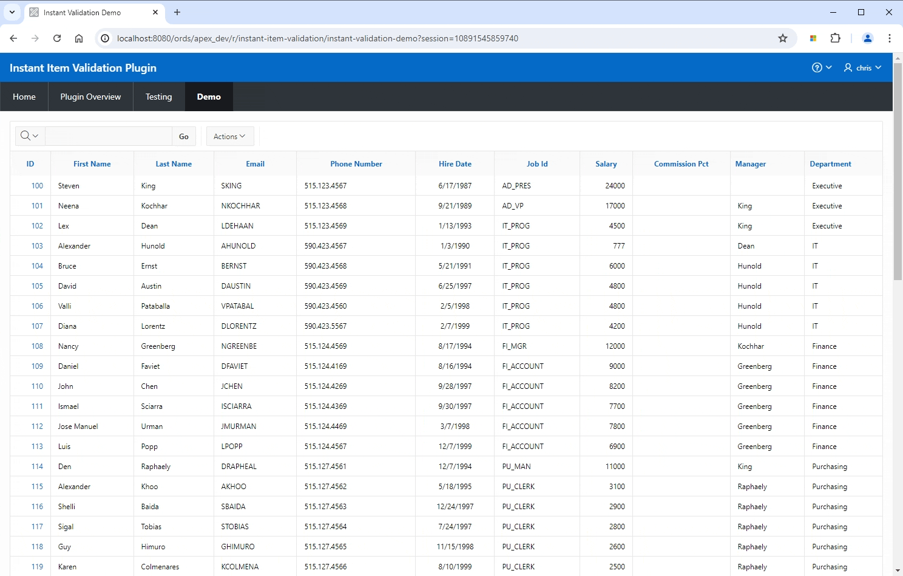
  

<b>Plug-in Features</b>

<ul>
  <li>Validate individual page items on request</li>
  <li>Bind execution of validation to any browser event</li>
  <li>Supports both client side (HTML5) and server side (PL/SQL) validation</li>
  <li>Supports custom error rendering</li>
  <li>Triggers browser events <code>instant-validation-start</code>, <code>instant-validation-failure</code> and <code>instant-validation-success</code></li>
  <li>Short-circuit evaluation of validations (first validation error is immediatelly returned to client)</li>
</ul>
  

<b>Supported Validations</b>

The plug-in supports the following validations:

<table>
  <tr>
    <th>Validation Code</th>
    <th>Validation Name</th>
  </tr>
  <tr>
    <td><code>EXISTS</code></td>
    <td>Rows returned</td>
  </tr>
  <tr>
    <td><code>NOT_EXISTS</code></td>
    <td>No Rows returned</td>
  </tr>
  <tr>
    <td><code>EXPRESSION</code></td>
    <td>Expression</td>
  </tr>
  <tr>
    <td><code>ITEM_REQUIRED</code></td>
    <td>Value Required</td>
  </tr>
  <tr>
    <td><code>NATIVE_NUMBER_FIELD</code></td>
    <td>Number field with optional min and max settings</td>
  </tr>
  <tr>
    <td><code>FUNC_BODY_RETURNING_BOOLEAN</code></td>
    <td>Function Body (returning Boolean)</td>
  </tr>
  <tr>
    <td><code>FUNC_BODY_RETURNING_ERR_TEXT</code></td>
    <td>Function Body (returning Error Text)</td>
  </tr>
  <tr>
    <td><code>ITEM_NOT_NULL</code></td>
    <td>Item is NOT NULL</td>
  </tr>
  <tr>
    <td><code>ITEM_NOT_NULL_OR_ZERO</code></td>
    <td>Item is NOT NULL or zero</td>
  </tr>
  <tr>
    <td><code>ITEM_IS_NOT_ZERO</code></td>
    <td>Item is NOT zero</td>
  </tr>
  <tr>
    <td><code>ITEM_CONTAINS_NO_SPACES</code></td>
    <td>Item contains no spaces</td>
  </tr>
  <tr>
    <td><code>ITEM_IS_ALPHANUMERIC</code></td>
    <td>Item is alphanumeric</td>
  </tr>
  <tr>
    <td><code>ITEM_IS_NUMERIC</code></td>
    <td>Item is numeric</td>
  </tr>
  <tr>
    <td><code>ITEM_IS_DATE</code></td>
    <td>Item is a valid date</td>
  </tr>
  <tr>
    <td><code>ITEM_IN_VALIDATION_EQ_STRING2</code></td>
    <td>Item = Value</td>
  </tr>
  <tr>
    <td><code>ITEM_IN_VALIDATION_NOT_EQ_STRING2</code></td>
    <td>Item != Value</td>
  </tr>
  <tr>
    <td><code>ITEM_IN_VALIDATION_IN_STRING2</code></td>
    <td>Item is contained in Value</td>
  </tr>
  <tr>
    <td><code>ITEM_IN_VALIDATION_NOT_IN_STRING2</code></td>
    <td>Item is NOT contained in Value</td>
  </tr>
  <tr>
    <td><code>ITEM_IN_VALIDATION_CONTAINS_ONLY_CHAR_IN_STRING2</code></td>
    <td>Item contains only characters specified in Value </td>
  </tr>
  <tr>
    <td><code>ITEM_IN_VALIDATION_CONTAINS_AT_LEAST_ONE_CHAR_IN_STRING2</code></td>
    <td>Item contain at least one of the characters in Value</td>
  </tr>
  <tr>
    <td><code>ITEM_IN_VALIDATION_CONTAINS_NO_CHAR_IN_STRING2</code></td>
    <td>Item does NOT contain any of the characters in Value</td>
  </tr>
  <tr>
    <td><code>REGULAR_EXPRESSION</code></td>
    <td>Item matches Regular Expression</td>
  </tr>
</table>
  

<b>Client Side vs Server Side Validation</b>

Some validations in APEX are implemented as <a href="https://developer.mozilla.org/en-US/docs/Web/HTML/Constraint_validation">HTML5 constraint validations</a>. A typical example is the <code>Value Required</code> flag you can set for a page item in the APEX builder:

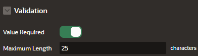

For the HTML input element APEX sets the <code>required</code> attribute:

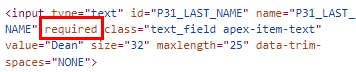

From a user perspective HTML5 constraint validations brings performance improvements since no server round trip is required to detect an input violation. However, for <b>security reasons</b> it is not recommended to rely on client side validations. An attacker could easly bypass client side validation e.g. by removing the <code>required</code> attribute in the HTML document.

APEX provides security features to both benefit from client side validation and prevent manipulation or bypassing of validation rules. Each client side validation is executed on the server side as well. For the <code>Value Required</code> example a column <code>Is Required</code> exists which can be queried via <code>apex_application_page_items</code> view. The plug-in ensures that client side validations are also executed on the server side!
  

<b>Installation</b>

Download the plug-in import file <code>dynamic_action_plug-in_org_christianhesse_instant_validation.sql</code>. Go to <code>Shared Components</code> > <code>Plug-ins</code> and choose <code>Import</code>. Follow the instructions in the wizzard.

  

<b>Plug-in Usage</b>

<ol>
  <li>
    
Define a validation for a page item: In this example restrict the input for <code>P31_LAST_NAME</code> to alphabetic characters.

    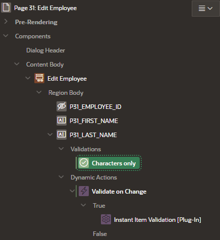
    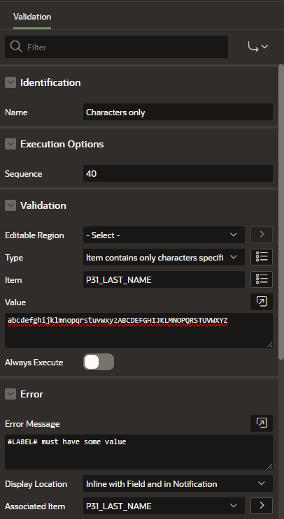
  </li>
  <li>
    
Create a <code>Dynamic Action</code> and bind it to the item's <code>Change</code> or <code>Lose Focus</code> event.

    
  </li>
  <li>
    
Define a <code>TRUE</code> Action and choose <code>Instant Item Validation [Plug-in]</code> from the available Actions.

    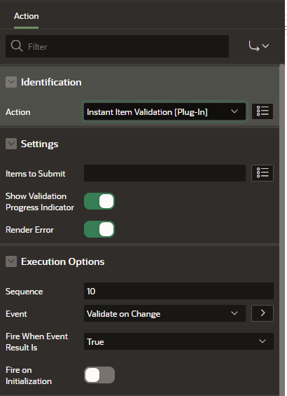
  </li>
  <li>
    
Save and run the page to test the plug-in.

    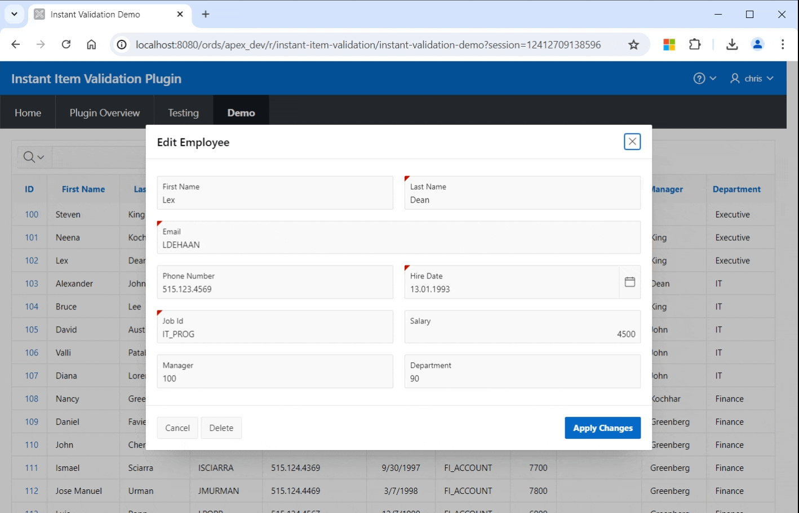    
  </li>
</ol>
  

<b>Plug-in Settings</b>

The plug-in defines the following settings:

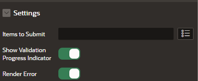
<table>
  <tr>
    <td><code>Items to Submit</code>:</td>
    <td>
      
Select or enter a list of comma separated page items to be submitted. The triggering page item gets always submitted (default).

      
If a validation expression or the validation condition for the triggering page item depends on other page item(s) enter the page item name(s) here.

    </td>
  </tr>
  <tr>
    <td><code>Show Validation Progress Indicator</code>:</td>
    <td>
      
If true, a 'Wait Indicator' spinner is displayed next to the triggering page item. Depending on the duration of the AJAX call the spinner may not show up (for low duration AJAX calls). If false no spinner will be displayed.

    </td>
  </tr>
  <tr>
    <td><code>Render Error</code>:</td>
    <td>
      
If true, a validation error will be displayed according to standard APEX validation error rendering. If false, no error rendering will be displayed.

      
Use false if you want to implement custom error rendering using the JavaScript plugin events <code>instant-validation-success</code> and <code>instant-validation-failure</code>. You can bind a Dynamic Action to each plugin event to excecute custom JavaScript code for validation error rendering. See <a href="#custom_error_rendering">here</a> for more details.

    </td>
  </tr>
</table>
  

<b>Plug-in Events</b>

The plug-in triggers the following browser events:

<table>
  <tr>
    <th>Event Name in APEX Builder</th>
    <th>Browser Event</th>
    <th>Description</th>
  </tr>
  <tr>
    <td>Instant Validation Start</td>
    <td><code>instant-validation-start</code></td>
    <td>Triggered when plug-in starts validation. Useful to check if validation is in progress (for longer running validations).</td>
  </tr>
  <tr>
    <td>Instant Validation Success</td>
    <td><code>instant-validation-success</code></td>
    <td>Triggered when all validations associated with the triggering page item pass. Indicates that the plug-in has finished execution.</td>
  </tr>
  <tr>
    <td>Instant Validation Failure</td>
    <td><code>instant-validation-failure</code></td>
    <td>Triggered when one validation associated with the triggering page item fails. The event is triggered immediatelly after the first failed validation (short circuit evaluation). Indicates that the plug-in has finished execution.</td>
  </tr>
  <tr>
    <td>Instant Validation Error</td>
    <td><code>instant-validation-error</code></td>
    <td>Triggered in case there is an error during the AJAX call. Indicates that the plug-in has finished execution.</td>
  </tr>
</table>

All events can be selected as Component Events for Dynamic Actions.

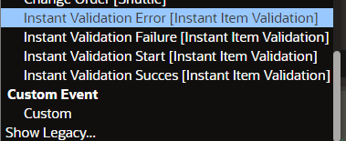
  

<b>Implementing Custom Error Rendering</b>

In the following example a custom error rendering routine is created to change the <code>background-color</code> of a page item with failed validation to red.

<ol>
  <li>
    
Create a new <code>Dynamic Action</code> and name it "Render Custom Validation Error".
 
    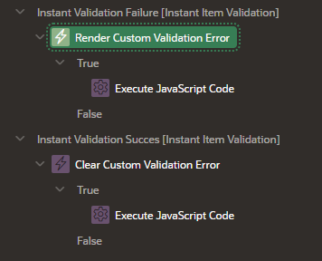
    
Select <code>Instant Validation Failure [Instant Item Validation]</code> as Event.

    
To implement a page wide error rendering routine choose <code>JavaScript Expression</code> as Selection Type and enter <code>document</code> as expression. In case you want to create an error rendering indiviual for a page item select <code>Item(s)</code> as Selection Type and choose the item.

    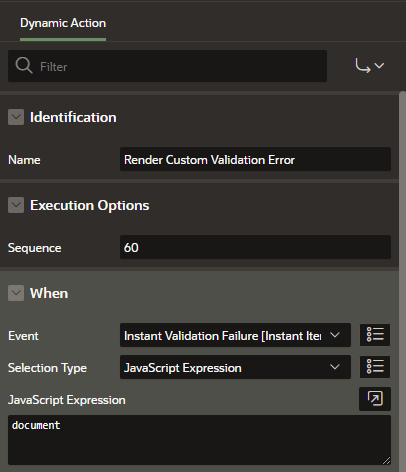
    
Create a TRUE Action <code>Execute JavaScript Code</code> and provide the following code:

    <pre>
let validationResult = this.data.validationResult;
apex.debug("Error rendering");
$('#' + validationResult.item).addClass('hasError');
$('#' + validationResult.item + '_error_placeholder').text(validationResult.message);
    </pre>
    
In case of validation errors the plug-in triggers the <code>instant-validation-failure</code> event and returns a JSON object with the following structure:

    <pre>
{
    "validationResult":{
        "item":"P31_LAST_NAME"
       ,"validationType":"ITEM_REQUIRED"
       ,"passed":false
      ,"message":"Last Name must have some value"
    }
}
    </pre>
    
To access the returned JSON object from the Dynamic Action use <code>this.data.validationResult</code>. The triggering item id can be determined with <code>this.data.validationResult.item</code> and the error message with <code>this.data.validationResult.message</code>

    
In the example above a CSS class <code>hasError</code> is set for the triggering item and the error message is shown in the items default error message placeholder.

    
Add following inline CSS code for the page:

    <pre>
.hasError {
    background-color: #eea29a;
}
    </pre>
  </li>
  <li>
    
Create a another <code>Dynamic Action</code> and name it "Clear Custom Validation Error".
 
    
Select <code>Instant Validation Success [Instant Item Validation]</code> as Event and use the same Selection Type as entered in Step 1.

    
Create a TRUE Action <code>Execute JavaScript Code</code> and provide the following code to clear the error (if present):

    <pre>
let validationResult = this.data.validationResult;
apex.debug("Error Clearing");
$('#' + validationResult.item).removeClass('hasError');
$('#' + validationResult.item + '_error_placeholder').text('');
    </pre>
  </li>
  <li>
     
Save and run the page to test the plug-in.

    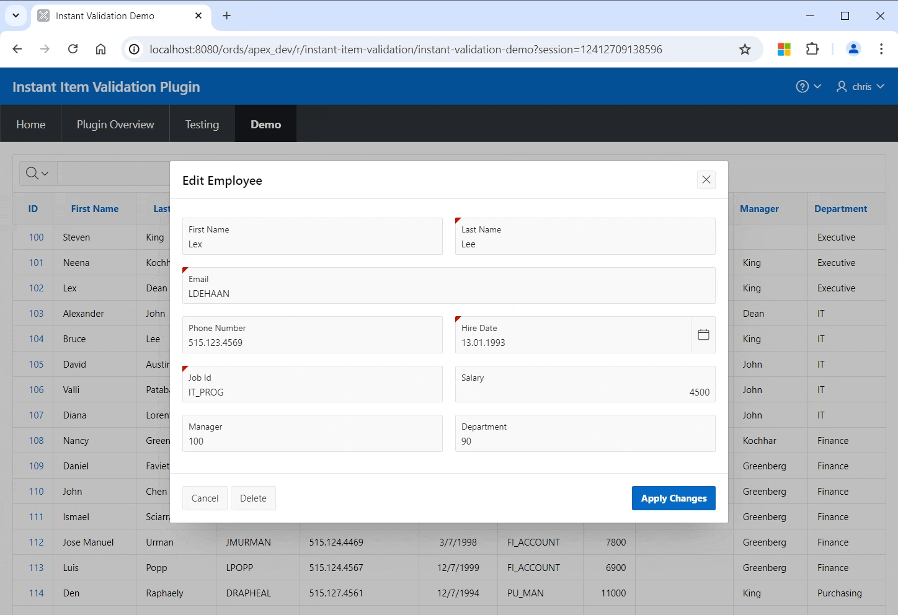
  </li>
</ol>

