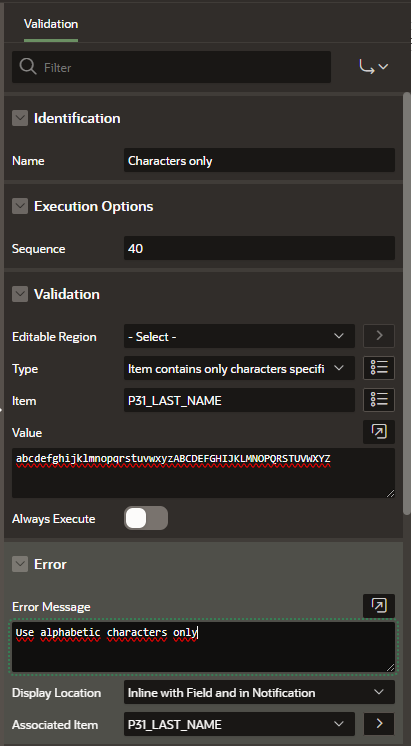
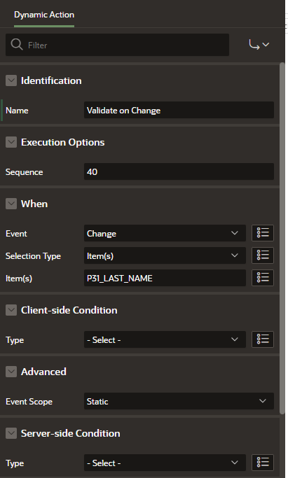

# instant-validation-plugin
<ul>
  <li><a href="#intro">Introduction</a></li>
  <li><a href="#features">Plug-in Features</a></li>
  <li><a href="#validation">Client side vs Server side validation</a></li>
  <li><a href="#installation">Installation</a></li>
  <li><a href="#usage">Plug-in Usage</a></li>  
</ul>

<b>Introduction</b>

Validate APEX page items instantly using this dynamic action plug-in. Bind the plug-in for example on an "onChange" event of a page item and immediatelly get a feedback if the user input for this page item is valid.

APEX validates page items in a submit process. If the page setting for <b>"Reload on Submit"</b> is set to "Only for Success" an AJAX call is performed prior to the acutal page submit. All validations for all page items are executed. In case of validation errors the error messages will be shown and the page is not submitted. With the standard APEX behavoir for validations there is no way to perform validations for individual page items and for events other then submit. This plug-in aims to close the gap. Bind it on any event for a page item and let the validations associated with this page item be executed whenever the event is triggered. In case of errors the item will be highlighted with an error message in the item's error placeholder (standard APEX error rendering) or a custom error handling can be implemented that is triggered whenever the plug-in fires the events <code>instant-validation-failure</code> or <code>instant-validation-success</code>.

  

<b>Plug-in Features</b>

<ul>
  <li>Validate individual page items on request</li>
  <li>Bind execution of validation to any browser event</li>
  <li>Supports both client side (HTML5) and server side (PL/SQL) validation</li>
  <li>Supports custom error rendering</li>
  <li>Triggers browser events <code>instant-validation-start</code>, <code>instant-validation-failure</code> and <code>instant-validation-success</code></li>
  <li>Short-circuit evaluation of validations (first validation error is immediatelly returned to client)</li>
</ul>
  

<b>Client side vs Server side validation</b>

Some validations in APEX are implemented as <a href="https://developer.mozilla.org/en-US/docs/Web/HTML/Constraint_validation">HTML5 constraint validations</a>. A typical example is the <code>Value Required</code> flag you can set for a page item in the APEX builder:

For the HTML input element APEX sets the <code>required</code> attribute:

From a user perspective HTML5 constraint validations brings performance improvements since no server round trip is required to detect an input violation. However, for <b>security reasons</b> it is not recommended to rely on client side validations. An attacker could easly bypass client side validation e.g. by removing the <code>required</code> attribute in the HTML document.

APEX provides security features to both benefit from client side validation and prevent manipulation or bypassing of validation rules. Each client side validation is executed on the server side as well. For the <code>Value Required</code> example a column <code>Is Required</code> exists which can be queried via <code>apex_application_page_items</code> view. The plug-in ensures that client side validations are also executed on the server side!
  

<b>Installation</b>

Download the plug-in import file <code>dynamic_action_plug-in_org_christianhesse_instant_validation.sql</code>. Go to <code>Shared Components</code> > <code>Plug-ins</code> and choose <code>Import</code>. Follow the instructions in the wizzard.

  

<b>Plug-in Usage</b>

<ol>
  <li>
    
Define a validation for a page item: In this example restrict the input for <code>P31_LAST_NAME</code> to alphabetic characters.

    
    
  </li>
  <li>
    
Create a <code>Dynamic Action</code> and bind it to the item's <code>Change</code> or <code>Lose Focus</code> event.

    
  </li>
  <li>
    
Define a <code>TRUE</code> Action and choose <code>Instant Item Validation [Plug-in]</code> from the available Actions.

    
  </li>
</ol>

